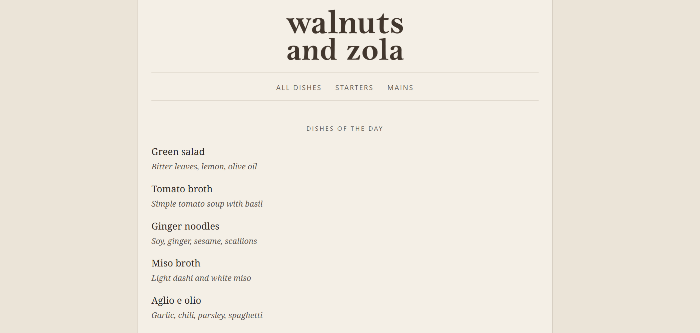

# walnuts-n-zola

A minimal, menu-style recipe theme for [Zola](https://www.getzola.org/).  
**Demo:** https://thelazyone.github.io/walnuts-n-zola/



## Install

```bash
git clone https://github.com/thelazyone/walnuts-n-zola themes/walnuts-n-zola
```

In your site's `config.toml`:

```toml
title = "My Menu"
theme = "walnuts-n-zola"

[extra]
dishes_of_the_day_count = 6
```

Requires Zola 0.19+.

## Logo

The theme ships a default logo at `static/images/logo.png`.

To use your own, add:

```
content/logo/_index.md
content/logo/logo.png
```

`content/logo/_index.md`:

```toml
+++
title = "Logo"
render = false
+++
```

If `content/logo/logo.png` is present, it replaces the default.

## Pages

Four page types:

| Page | Path | Content file |
|---|---|---|
| **Home** | `/` | `content/_index.md` |
| **All dishes** | `/menu/` | `content/menu/_index.md` |
| **Section** | `/pastas/` etc. | `content/menu/pastas/_index.md` |
| **Recipe** | `/arrabbiata/` etc. | `content/menu/.../arrabbiata.md` |

Sections contain subsections (`render = false`) and recipes (`template = "recipe.html"`, `path = "slug"`). See `exampleSite/content/` for a working example.

## Recipe editor

Visual editor for menu content. From your **site root**:

```bash
cd themes/walnuts-n-zola
python -m scripts.recipe_editor
```

The script finds your site automatically when the theme lives in `themes/`. Or pass the site root explicitly:

```bash
python -m scripts.recipe_editor --root /path/to/your/site
```

Requires Python 3.10+.

## License

MIT — see [LICENSE](LICENSE).
